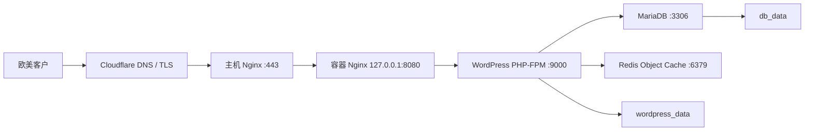

# AROMAMATRIX WordPress 部署文档

本文档用于部署和维护 `www.13799.com` 的 WordPress + WooCommerce 服务。当前网站主要用于 Private Label 香水产品、规格和价格展示，并通过 WhatsApp 引导客户询价；架构同时保留了后续创建订单和在线收款的能力。

## 1. 当前生产环境

| 项目 | 当前值 |
|---|---|
| 域名 | `https://www.13799.com` |
| SSH | `root@site` |
| 服务器系统 | Ubuntu 24.04 |
| 服务器项目目录 | `/root/wordpress-sites/aromamatrix-shop` |
| 本地项目目录 | `~/Documents/wordpress-sites/aromamatrix-shop` |
| 主机 Nginx | Nginx 1.24 |
| Docker | Docker 29.1 |
| Docker Compose | Compose 2.40 |
| WordPress | `wordpress:7.0-php8.3-fpm` |
| MariaDB | `mariadb:11.8` |
| Redis | `redis:7.4-alpine` |
| 容器 Nginx | `nginx:1.28-alpine` |

生产服务器的实际版本可能在后续维护时升级。每次升级镜像前必须先备份，并阅读对应镜像的升级说明。

## 2. 架构



关键边界：

- 对外只开放 SSH、HTTP 和 HTTPS。
- 主机 Nginx 终止 TLS，并反向代理到 `127.0.0.1:8080`。
- MariaDB 只绑定主机 `127.0.0.1`，用于本机或 SSH Tunnel。
- Redis 不映射宿主机端口，只能从 Docker `backend` 内网访问。
- `backend` 网络设置为 `internal: true`。
- WordPress 文件保存在 `wordpress_data` named volume。
- MariaDB 数据保存在 `db_data` named volume。
- Redis 仅保存可重建缓存，不做磁盘持久化。

## 3. 项目目录

```text
wordpress-sites/aromamatrix-shop/
├── compose.yaml
├── .env.example
├── DEPLOYMENT.md
├── README.md
├── cert/
│   ├── www.13799.com.pem
│   └── www.13799.com.key
├── nginx/
│   ├── conf.d/default.conf
│   └── host/www.13799.com.conf
├── php/uploads.ini
└── scripts/backup.sh
```

以下内容不得提交 Git：

- `.env`
- `cert/`
- 数据库导出
- `backups/`
- WordPress 上传文件
- 包含客户信息或订单信息的文件

## 4. 首次部署

### 4.1 服务器要求

推荐使用 Ubuntu 24.04，并安装：

- Docker Engine
- Docker Compose v2
- Nginx
- OpenSSH Server
- `rsync`、`curl`、`gzip` 和 `tar`

检查：

```bash
docker --version
docker compose version
nginx -v
systemctl is-active docker
systemctl is-active nginx
```

生产服务器建议至少具备：

- 2 个 CPU
- 4 GB 内存
- 40 GB SSD
- 独立 Swap 或足够可用内存

当前服务器资源明显高于最低要求。

### 4.2 DNS 与 Cloudflare

在 Cloudflare 中为 `www.13799.com` 创建指向 VPS 公网 IP 的 DNS 记录，并将根域名 `13799.com` 指向同一位置。

Cloudflare 设置：

```text
SSL/TLS mode: Full (strict)
```

不要使用 `Flexible`，否则可能产生 HTTPS 重定向循环。

如果启用 Cloudflare 页面缓存，应绕过以下动态路径：

```text
/wp-admin/*
/wp-login.php
/cart/*
/checkout/*
/my-account/*
```

### 4.3 上传项目

在本地执行：

```bash
cd ~/Documents/wordpress-sites/aromamatrix-shop

ssh root@site 'mkdir -p /root/wordpress-sites/aromamatrix-shop'

rsync -av \
  --exclude '.git/' \
  --exclude '.env' \
  --exclude 'cert/' \
  --exclude 'backups/' \
  ./ root@site:/root/wordpress-sites/aromamatrix-shop/
```

不要使用未经确认的 `rsync --delete`，避免误删服务器上的 `.env`、备份或其他生产文件。

### 4.4 创建生产环境变量

登录服务器：

```bash
ssh root@site
cd /root/wordpress-sites/aromamatrix-shop

cp .env.example .env
chmod 600 .env
nano .env
```

生产环境至少确认以下值：

```dotenv
COMPOSE_PROJECT_NAME=wordpress

HTTP_BIND_IP=127.0.0.1
HTTP_PORT=8080

MARIADB_DATABASE=wordpress
MARIADB_USER=wordpress
MARIADB_PASSWORD=替换为随机高强度密码
MARIADB_ROOT_PASSWORD=替换为另一组随机高强度密码
MARIADB_HOST_PORT=3306

WORDPRESS_TABLE_PREFIX=wp_
WORDPRESS_REDIS_DATABASE=0
REDIS_MAXMEMORY=256mb
```

可以分别生成两个密码：

```bash
openssl rand -base64 36
openssl rand -base64 36
```

注意：

- 两个 MariaDB 密码必须不同。
- `.env` 只保存在服务器和密码管理器中。
- 正式环境必须使用 `HTTP_BIND_IP=127.0.0.1`，避免绕过主机 Nginx 和 HTTPS。
- 已经初始化数据库后，不要随意修改数据库名、用户名或表前缀。

### 4.5 安装 Cloudflare Origin Certificate

在服务器创建证书目录：

```bash
ssh root@site 'install -d -m 700 /etc/nginx/ssl'
```

从本地上传证书：

```bash
scp cert/www.13799.com.pem \
  root@site:/etc/nginx/ssl/www.13799.com.pem

scp cert/www.13799.com.key \
  root@site:/etc/nginx/ssl/www.13799.com.key
```

设置权限：

```bash
ssh root@site
chmod 644 /etc/nginx/ssl/www.13799.com.pem
chmod 600 /etc/nginx/ssl/www.13799.com.key
```

私钥不得发送到聊天、提交 Git 或放入公开下载目录。

### 4.6 安装主机 Nginx 配置

从本地上传：

```bash
scp nginx/host/www.13799.com.conf \
  root@site:/etc/nginx/sites-available/www.13799.com
```

服务器执行：

```bash
ln -sfn \
  /etc/nginx/sites-available/www.13799.com \
  /etc/nginx/sites-enabled/www.13799.com

nginx -t
systemctl reload nginx
```

只有 `nginx -t` 成功后才能 reload。

### 4.7 启动容器

服务器执行：

```bash
cd /root/wordpress-sites/aromamatrix-shop

docker compose config --quiet
docker compose pull
docker compose up -d --wait --wait-timeout 180
docker compose ps
```

四个服务都应为 `healthy`：

```text
db
redis
wordpress
nginx
```

不要执行：

```bash
docker compose down -v
```

`-v` 会删除 WordPress 和数据库 named volumes。

### 4.8 WordPress 首次初始化

访问：

```text
https://www.13799.com
```

完成 WordPress 初始化时：

- 不要使用 `admin` 作为管理员用户名。
- 使用独立、高强度密码并开启双重验证。
- 网站语言、时区、固定链接应在发布商品前确认。
- WooCommerce 初期可以仅展示产品与单价，不必立即启用购物车和在线支付。
- WhatsApp 询价按钮应出现在产品页和移动端显眼位置。

## 5. Redis Object Cache

安装 WordPress 插件：

```text
Redis Object Cache
Author: Till Krüss
Plugin slug: redis-cache
```

插件不提供 Redis Host/Port 输入框；连接信息由 Compose 注入到 WordPress：

```text
WP_REDIS_HOST=redis
WP_REDIS_PORT=6379
```

安装并激活插件后，进入：

```text
WordPress 后台
→ Settings
→ Redis
→ Enable Object Cache
```

服务器验证：

```bash
cd /root/wordpress-sites/aromamatrix-shop

docker compose exec redis redis-cli ping

docker compose exec wordpress sh -lc \
  'echo "$WORDPRESS_REDIS_HOST:$WORDPRESS_REDIS_PORT"'
```

预期输出：

```text
PONG
redis:6379
```

查看 Redis 与 WordPress 日志：

```bash
docker compose logs --tail=100 redis
docker compose logs --tail=100 wordpress
```

Redis 设置说明：

- 最大内存默认 256 MB。
- 内存满后使用 `allkeys-lru` 淘汰较少访问的键。
- Redis 不持久化；容器重启后缓存自动重建。
- Redis 不能存放订单、产品或其他唯一数据。

## 6. 日常发布与更新

当前服务器 `/root/wordpress-sites/aromamatrix-shop` 不是 Git 工作区，发布使用“本地确认、上传临时文件、远端校验、备份切换”的方式。

### 6.1 更新前

本地检查：

```bash
cd ~/Documents/wordpress-sites/aromamatrix-shop
git status
docker compose --env-file .env.example config --quiet
```

服务器备份：

```bash
ssh root@site
cd /root/wordpress-sites/aromamatrix-shop
./scripts/backup.sh
```

### 6.2 更新 Compose

本地上传为临时文件：

```bash
scp compose.yaml \
  root@site:/root/wordpress-sites/aromamatrix-shop/compose.yaml.new
```

服务器校验并切换：

```bash
ssh root@site
cd /root/wordpress-sites/aromamatrix-shop

docker compose -f compose.yaml.new config --quiet

cp -p compose.yaml \
  "compose.yaml.bak.$(date +%Y%m%d-%H%M%S)"

mv compose.yaml.new compose.yaml

docker compose pull
docker compose up -d --wait --wait-timeout 180
docker compose ps
```

如果配置校验失败，不要覆盖当前 `compose.yaml`。

### 6.3 更新 Nginx 或 PHP 配置

上传相关文件后执行：

```bash
cd /root/wordpress-sites/aromamatrix-shop

docker compose config --quiet
docker compose up -d --wait --wait-timeout 180

nginx -t
systemctl reload nginx
```

容器 Nginx 配置变化会重建或重启容器；主机 Nginx 配置变化必须执行 `nginx -t` 和 `systemctl reload nginx`。

### 6.4 更新镜像

修改 `.env` 中的镜像标签之前：

1. 运行完整备份。
2. 阅读 WordPress、MariaDB、Redis 或 Nginx 的升级说明。
3. 一次只升级一个关键组件。
4. 在低流量时间部署。
5. 部署后检查后台、产品页、询价按钮、语言切换和 Redis。

不要使用未固定版本的 `latest` 标签。

## 7. 健康检查与验收

### 7.1 容器

```bash
cd /root/wordpress-sites/aromamatrix-shop
docker compose ps
```

### 7.2 Redis

```bash
docker compose exec redis redis-cli ping
```

预期：

```text
PONG
```

### 7.3 网站本机入口

```bash
curl -I http://127.0.0.1:8080/
```

301 或 200 均可能正常，取决于 WordPress 的站点 URL 和 HTTPS 重定向设置。

### 7.4 公网 HTTPS

```bash
curl -I https://www.13799.com/
```

检查：

- HTTP 状态为 200 或预期的 301。
- TLS 证书有效。
- 不存在无限重定向。
- 产品页面可以打开。
- 多语言切换正常。
- WhatsApp 链接正常。
- WordPress 后台可登录。
- Redis Object Cache 显示 `Connected` 和 `Enabled`。

### 7.5 日志

```bash
docker compose logs --tail=100 db
docker compose logs --tail=100 redis
docker compose logs --tail=100 wordpress
docker compose logs --tail=100 nginx

journalctl -u nginx --since '30 minutes ago'
```

持续跟踪：

```bash
docker compose logs -f --tail=100
```

## 8. 备份

执行完整备份：

```bash
cd /root/wordpress-sites/aromamatrix-shop
./scripts/backup.sh
```

生成内容：

```text
backups/database-时间.sql.gz
backups/wp-content-时间.tar.gz
backups/checksums-时间.sha256
```

校验：

```bash
cd /root/wordpress-sites/aromamatrix-shop/backups
sha256sum -c checksums-时间.sha256
gzip -t database-时间.sql.gz
tar -tzf wp-content-时间.tar.gz >/dev/null
```

建议排程：

```cron
15 3 * * * cd /root/wordpress-sites/aromamatrix-shop && ./scripts/backup.sh >> /var/log/wordpress-backup.log 2>&1
```

建议保留：

```text
每日 7 份
每周 4 份
每月 6 份
```

本机备份不能防止整台 VPS 损坏。至少再同步一份到 S3、Backblaze B2 或另一台服务器，并定期测试恢复。

## 9. 恢复

恢复会覆盖生产数据。操作前先建立当前备份，并确认目标备份的时间。

先停止容器 Nginx，避免恢复过程中继续写入：

```bash
cd /root/wordpress-sites/aromamatrix-shop
docker compose stop nginx
```

恢复数据库：

```bash
gzip -dc backups/database-时间.sql.gz | \
  docker compose exec -T db sh -ec \
  'exec mariadb --user=root --password="$MARIADB_ROOT_PASSWORD"'
```

恢复 `wp-content`：

```bash
docker compose exec -T wordpress \
  tar -C /var/www/html -xzf - \
  < backups/wp-content-时间.tar.gz
```

清空可重建的 Redis 缓存并恢复入口：

```bash
docker compose exec redis redis-cli FLUSHDB
docker compose restart wordpress
docker compose start nginx
docker compose ps
```

完成后重新执行第 7 节验收。

## 10. 回滚

### 10.1 仅回滚 Compose 配置

查看备份：

```bash
cd /root/wordpress-sites/aromamatrix-shop
ls -1t compose.yaml.bak.*
```

恢复指定版本：

```bash
cp -p compose.yaml.bak.时间 compose.yaml
docker compose config --quiet
docker compose up -d --wait --wait-timeout 180
```

### 10.2 回滚数据

Compose 回滚不会回滚数据库、插件或上传文件。数据回滚必须使用第 8、9 节的数据库和 `wp-content` 备份。

## 11. 常用操作

```bash
cd /root/wordpress-sites/aromamatrix-shop

# 查看状态
docker compose ps

# 重启全部服务
docker compose restart

# 只重启 WordPress
docker compose restart wordpress

# 查看资源占用
docker stats --no-stream

# 查看 Redis 内存
docker compose exec redis redis-cli INFO memory

# 刷新 Redis 缓存
docker compose exec redis redis-cli FLUSHDB

# 停止服务但保留数据
docker compose down

# 启动并等待健康
docker compose up -d --wait --wait-timeout 180
```

## 12. 故障排查

### Redis 显示 `127.0.0.1:6379`

说明 WordPress 容器没有加载 Compose 中的新环境变量：

```bash
cd /root/wordpress-sites/aromamatrix-shop
docker compose up -d redis
docker compose up -d --force-recreate wordpress

docker compose exec wordpress sh -lc \
  'echo "$WORDPRESS_REDIS_HOST:$WORDPRESS_REDIS_PORT"'
```

正确结果应为 `redis:6379`。

### Redis `Unreachable`

```bash
docker compose ps redis
docker compose logs --tail=100 redis
docker compose exec redis redis-cli ping
```

不要把 Redis 端口映射到公网来解决连接问题。

### 网站出现 502

```bash
docker compose ps
docker compose logs --tail=100 wordpress nginx
curl -I http://127.0.0.1:8080/
nginx -t
journalctl -u nginx --since '30 minutes ago'
```

### HTTPS 重定向循环

确认：

- Cloudflare SSL/TLS 使用 `Full (strict)`。
- 主机 Nginx 传递 `X-Forwarded-Proto https`。
- `.env` 中 `HTTP_BIND_IP=127.0.0.1`。
- WordPress Address 和 Site Address 都使用 `https://www.13799.com`。

### MariaDB 不健康

```bash
docker compose ps db
docker compose logs --tail=200 db
df -h /
free -h
```

不要删除 `db_data` volume。数据库恢复前必须先做备份。

### 上传大文件失败

当前 PHP 和 Nginx 上传上限为 64 MB。检查：

```text
php/uploads.ini
nginx/conf.d/default.conf
nginx/host/www.13799.com.conf
```

三处限制需要保持一致，修改后重新部署容器并 reload 主机 Nginx。

## 13. 安全检查清单

- SSH 只允许密钥登录，关闭密码登录。
- 建议后续创建独立运维用户并限制直接 root 登录。
- 防火墙只开放必要端口：22、80、443。
- `HTTP_BIND_IP` 使用 `127.0.0.1`。
- MariaDB 只绑定 `127.0.0.1`。
- Redis 不映射宿主机端口。
- `.env` 权限为 600。
- TLS 私钥权限为 600。
- Cloudflare 使用 `Full (strict)`。
- WordPress 管理员开启双重验证。
- 定期更新 WordPress、WooCommerce、主题和插件。
- 删除未使用的主题和插件。
- 每次关键更新前运行完整备份。
- 备份至少有一份异地副本。
- 每月至少测试一次恢复流程。
